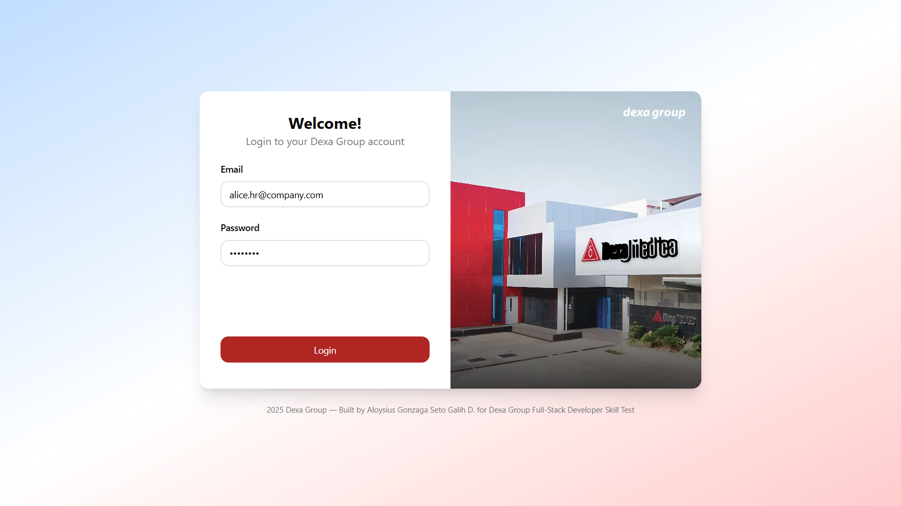
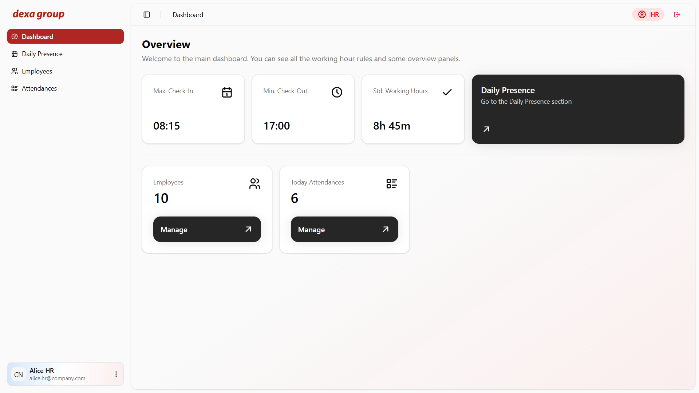
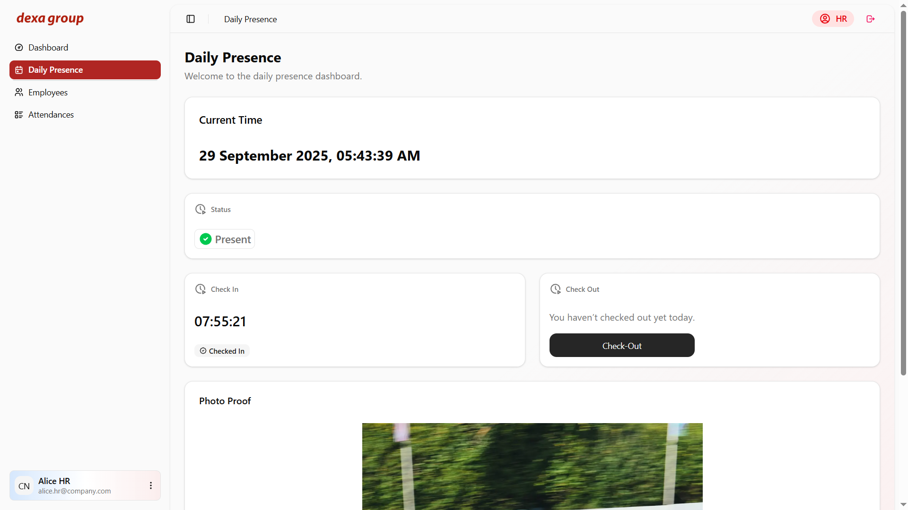
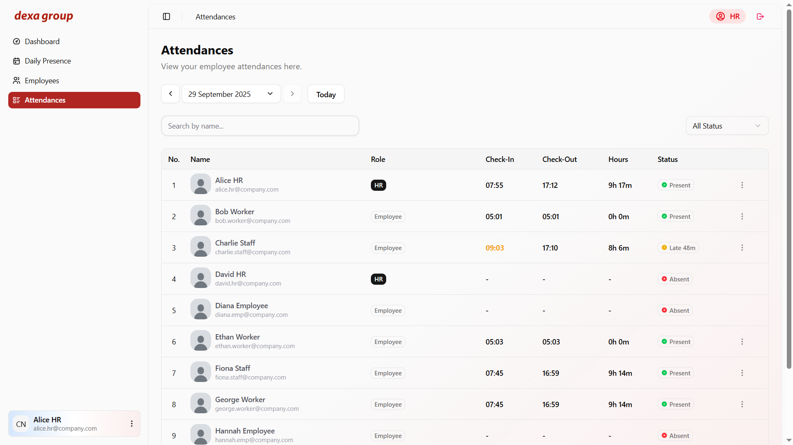

# Dexa Group - Web Application Project

## Overview

This project was built by **Aloysius Gonzaga Seto Galih D.** as part of the **Dexa Group Full-Stack Developer Skill Test**, designed to provide a **comprehensive attendance management system** for employees and HR staff. The application allows seamless **remote work tracking**, including **Work From Home (WFH)** scenarios, where employees can log their presence, upload proof of attendance, and track their daily work hours.



## Key & Feature Highlights

- **Multi-role system**: Separate dashboards and functionalities for HR and Employee roles.
- **Attendance tracking**: Employees can check-in and check-out, with the system automatically tracking daily attendance status.
- **Photo proof**: Users can upload an image during check-in for validation purposes.
- **HR management dashboard**: HR can create, update, and monitor employee records and attendance data efficiently.
- **Clean and responsive UI design**: A modern, intuitive, beautiful, clean, and mobile-friendly interface built with Next.js and ShadCN UI.
- **Time-zone aware system**: All timestamps are stored in UTC, displayed in GMT+7 for consistency.
- **Secure authentication**: Access control is implemented via role-based guards and HTTP-only cookies to protect sensitive information.

This project demonstrates **full-stack development skills** by integrating **Next.js** for front-end, **Nest.js** for back-end, **Prisma** for database management, and **MySQL** as the persistent storage solution. The system is built for **scalability**, **maintainability**, and **real-world HR use cases**.



## Use Cases

This web application is designed to address common HR and employee needs in a modern workplace. It focuses on **simplifying attendance tracking, monitoring employee activity, and providing actionable insights** for management. The system is particularly useful for organizations that support **remote work** or need a **digital attendance solution**.

1. ### **Work From Home (WFH) Employee Attendance**

   

   - A web application that allows employees to log in securely.
   - Record daily attendance, capturing **date & time**.
   - Upload a **photo** as proof of working from home.

2. ### **Employee Monitoring**

   

   - An admin (HR) dashboard for managing employee data, such as create and update employee records.
   - Monitor submitted attendance in a **view-only** mode.

---

## Table of Contents

- [Overview](#overview)
- [Key & Feature Highlights](#key--feature-highlights)
- [Use Cases](#use-cases)
- [Tech Stacks](#tech-stacks)
- [Front-end Tech & Features](#front-end-tech--features)
- [Back-end Tech & Features](#back-end-tech--features)
- [API Endpoints](#api-endpoints)
- [Usage](#usage)
- [Notes](#notes)

---

## Tech Stacks

- ### Front-end

  - **Next.js (TypeScript)** – The React Framework for the Web. Used by some of the world's largest companies, Next.js enables you to create **high-quality web applications** with the power of React components, server-side rendering, and static generation.

- ### Back-end

  - **Nest.js (TypeScript)** – A progressive Node.js framework. Nest.js provides **scalable, maintainable, and testable architecture** for building back-end applications with TypeScript.

- ### Database

  - **MySQL** – Relational database for storing employee and attendance data.

---

## Front-end Tech & Features

- **Next.js (TS)** – App router, server/client components
- **TanStack Query** – Data fetching & caching
- **ShadCN UI & Hero UI** – UI components & form handling
- **React Hook Form + Zod** – Form validation
- **Axios** – API client
- **date-fns + date-fns-tz** – Date & timezone handling
- **React Dropzone** – Drag & drop image upload

---

## Back-end Tech & Features

- **Nest.js (TS)** – Modular architecture, dependency injection
- **Prisma ORM** – Type-safe database queries
- **HTTP Only Cookie Authentication** – UUID token wrapped inside cookie for authentication
- **Multer** – File upload (check-in image)
- **DateTime handling** – Store in UTC, display in GMT+7
- **Guards** – Middleware for role-based authentication & authorization

---

## API Endpoints

### Auth

| Method | Endpoint             | Description                         | Roles           |
| ------ | -------------------- | ----------------------------------- | --------------- |
| POST   | `/api/auth/login`    | User login                          | (Guest)         |
| DELETE | `/api/auth/logout`   | User logout                         | (Authenticated) |
| GET    | `/api/users/current` | Get current authenticated user info | (Authenticated) |

### Attendance

| Method | Endpoint                         | Description                             | Roles        |
| ------ | -------------------------------- | --------------------------------------- | ------------ |
| GET    | `/api/attendances/current`       | Get current attendance for current user | Employee, HR |
| POST   | `/api/attendances/check-in`      | Check in for current user               | Employee, HR |
| PATCH  | `/api/attendances/check-out/:id` | Check out for current user              | Employee, HR |
| GET    | `/api/attendances`               | List attendances for a specific date    | HR           |
| GET    | `/api/attendances/:id`           | Get single attendance detail by ID      | HR           |

### Employee

| Method | Endpoint             | Description               | Roles |
| ------ | -------------------- | ------------------------- | ----- |
| POST   | `/api/employees`     | Create a new employee     | HR    |
| GET    | `/api/employees`     | Get all employees         | HR    |
| GET    | `/api/employees/:id` | Get single employee by ID | HR    |
| PATCH  | `/api/employees/:id` | Update employee by ID     | HR    |
| DELETE | `/api/employees/:id` | Delete employee by ID     | HR    |

### Upload

| Method | Endpoint            | Description           | Roles        |
| ------ | ------------------- | --------------------- | ------------ |
| POST   | `/api/upload/image` | Upload check-in image | Employee, HR |

### Main Dashboard Content

| Method | Endpoint                 | Description                                 | Roles        |
| ------ | ------------------------ | ------------------------------------------- | ------------ |
| GET    | `/api/dashboard/current` | Get main dashboard content for current user | Employee, HR |

---

## Usage

### Back-end

Clone the repository:

```bash
git clone https://github.com/AloysiussG/backend-dexa.git
cd backend-dexa
```

Install dependencies:

```bash
npm install
```

**(Optional)** Setup environment variables. For temporary quick test, the URL endpoints are already stored in the files. The default port of the back-end are set to 8000. Please see the **project directories**.

```env
NEXT_FRONTEND_APP_URL: 'http://localhost:3000',
NEST_BACKEND_APP_URL: 'http://localhost:8000',
```

Create MySQL database:

```bash
CREATE DATABASE dexagroup_seto;
```

Run the migration:

```bash
npx prisma migrate dev
```

Run database seeder. You can see all the data that will be generated inside **src/seeder/data** folder, with the name of **users.json** and **attendances.json**.

```bash
npm run seed
```

Run the project:

```bash
npm run start:dev
```

### Front-end

Clone the repository:

```bash
git clone https://github.com/AloysiussG/frontend-dexa.git
cd frontend-dexa
```

Install dependencies:

```bash
npm install
```

**(Optional)** Setup environment variables. For temporary quick test, the URL endpoints are already stored in the files. The default port of the front-end are set to 3000. Please see the **project directories**.

```env
NEXT_FRONTEND_APP_URL: 'http://localhost:3000',
NEST_BACKEND_APP_URL: 'http://localhost:8000',
```

Run the project:

```bash
npm run dev
```

Open the browser:

```arduino
http://localhost:3000
```

---

## Notes

- **Timezone**: Back-end stores all dates in UTC; front-end displays in Asia/Jakarta (GMT+7).
- **React Query**: Caches user and attendance data to reduce API calls.
- **React Hook Form + Zod**: Validates forms including file uploads.
- **Loading States**: Delays can be added to simulate UX feedback for buttons.
- **Token**: Authentication uses UUID tokens & HTTP Only cookie, instead of JWT. Token stored inside **users** table.
