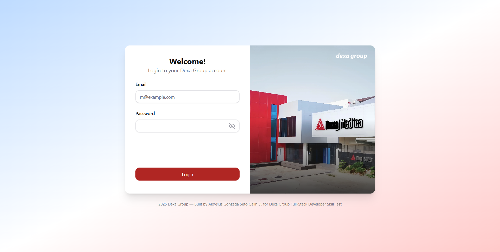

# Dexa Group - Web Application Project

## Overview

This project was built by **Aloysius Gonzaga Seto Galih D.** for the **Dexa Group Full-Stack Developer Skill Test**, designed for **user attendance management**.




### Web Application Use Cases

1. **Work From Home (WFH) Employee Attendance**

   

   - A web application that allows employees to log in securely.
   - Record daily attendance, capturing **date & time**.
   - Upload a **photo** as proof of working from home.

2. **Employee Monitoring**

   

   - An admin (HR) dashboard for managing employee data, such as create and update employee records.
   - Monitor submitted attendance in a **view-only** mode.

---

## Table of Contents

- [Main Tech Stacks](#main-tech-stacks)
- [Feature Highlights](#feature-highlights)
- [Front-end Tech & Features](#front-end-tech--features)
- [Back-end Tech & Features](#back-end-tech--features)
- [API Endpoints](#api-endpoints)
- [Usage](#usage)
- [Notes](#notes)

---

## Main Tech Stacks

### Front-end

**Next.js (TypeScript)** – The React Framework for the Web  
Used by some of the world's largest companies, Next.js enables you to create **high-quality web applications** with the power of React components, server-side rendering, and static generation.

### Back-end

**Nest.js (TypeScript)** – A progressive Node.js framework  
Nest.js provides **scalable, maintainable, and testable architecture** for building back-end applications with TypeScript.

### Database

**MySQL** – Relational database for storing employee and attendance data.

---

## Feature Highlights

- **Multi-role user authentication:** HR, Employee
- **Daily presence:** check-in & check-out
- **Image upload:** drag-and-drop file upload with validation
- **Employee management:** create, read, update, and delete (CRUD) for HR
- **Attendance management:** view attendances with timezone-aware status (Present, Late, Absent)
- **Clean and responsive UI/UX:** built with fancy and fully-responsive UI with seamless front-end validation and state management

---

## Front-end Tech & Features

- **Next.js (TS)** – App router, server/client components
- **TanStack Query** – Data fetching & caching
- **ShadCN UI & Hero UI** – UI components & form handling
- **React Hook Form + Zod** – Form validation
- **Axios** – API client
- **date-fns + date-fns-tz** – Date & timezone handling

---

## Back-end Tech & Features

- **Nest.js (TS)** – Modular architecture, dependency injection
- **Prisma ORM** – Type-safe database queries
- **HTTP Only Cookie Authentication** – UUID token wrapped inside cookie for authentication
- **Multer** – File upload (check-in image)
- **DateTime handling** – Store in UTC, display in GMT+7
- **Guards** – Middleware for role-based authentication & authorization

---

## API Endpoints

### Auth

| Method | Endpoint             | Description           |
| ------ | -------------------- | --------------------- |
| POST   | `/api/auth/login`    | User login            |
| DELETE | `/api/auth/logout`   | User logout           |
| GET    | `/api/users/current` | Get current user info |

### Attendance

| Method | Endpoint                     | Description                 |
| ------ | ---------------------------- | --------------------------- |
| POST   | `/api/attendances/check-in`  | User check-in               |
| PATCH  | `/api/attendances/check-out` | User check-out              |
| GET    | `/api/attendances/today`     | Get current user attendance |

### Upload

| Method | Endpoint            | Description           |
| ------ | ------------------- | --------------------- |
| POST   | `/api/upload/image` | Upload check-in image |

---

## Usage

### Back-end

Clone the repository:

```bash
git clone https://github.com/AloysiussG/backend-dexa.git
cd backend-dexa
```

Install dependencies:

```bash
npm install
```

**(Optional)** Setup environment variables. For temporary quick test, the URL endpoints are already stored in the files. The default port of the back-end are set to 8000. Please see the **project directories**.

```env
NEXT_FRONTEND_APP_URL: 'http://localhost:3000',
NEST_BACKEND_APP_URL: 'http://localhost:8000',
```

Create MySQL database:

```bash
CREATE DATABASE dexagroup_seto;

```

Run the migration:

```bash
npx prisma migrate dev
```

Run database seeder. You can see all the data that will be generated inside **src/seeder/data** folder, with the name of **users.json** and **attendances.json**.

```bash
npm run seed
```

Run the project:

```bash
npm run start:dev
```

### Front-end

Clone the repository:

```bash
git clone https://github.com/AloysiussG/frontend-dexa.git
cd frontend-dexa
```

Install dependencies:

```bash
npm install
```

**(Optional)** Setup environment variables. For temporary quick test, the URL endpoints are already stored in the files. The default port of the front-end are set to 3000. Please see the **project directories**.

```env
NEXT_FRONTEND_APP_URL: 'http://localhost:3000',
NEST_BACKEND_APP_URL: 'http://localhost:8000',
```

Run the project:

```bash
npm run dev
```

Open the browser:

```arduino
http://localhost:3000
```

---

## Notes

- **Timezone**: Back-end stores all dates in UTC; front-end displays in Asia/Jakarta (GMT+7).
- **React Query**: Caches user and attendance data to reduce API calls.
- **React Hook Form + Zod**: Validates forms including file uploads.
- **Loading States**: Delays can be added to simulate UX feedback for buttons.
- **Token**: Authentication uses UUID tokens & HTTP Only cookie, instead of JWT. Token stored inside **users** table.
